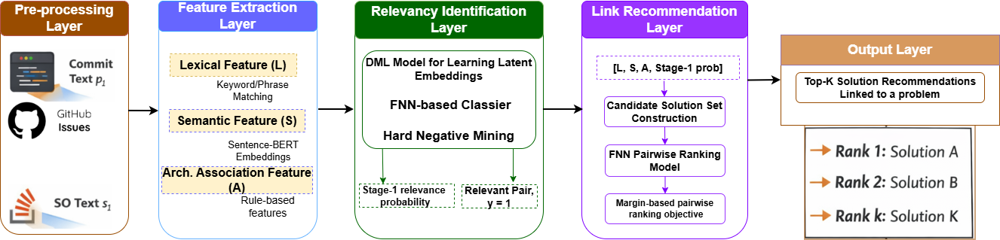

# Replication Package for the Paper: CPArchPSLinker: Cross-Platform Linking of Architectural Solutions from Q&A Platforms to Architectural Problems in Commits and Issues

This replication package accompanies the paper CPArchPSLinker: Cross-Platform Linking of Architectural Solutions from Q&A Platforms like Stack Overflow (SO) to Architectural Problems in Commits and Issues.
The repository provides an introduction and an overview of CPArchPSLinker, along with its source code and baseline implementations, the dataset of GitHub commits/issues and Stack Overflow posts used in our study, and the experimental results.

## 🚨 Introduction

Collaborative development platforms such as GitHub and Q&A sites like SO serve as complementary knowledge sources in the Open Source Software (OSS) ecosystem. When developers
encounter architectural problems during OSS development, such as architectural anti-patterns, modularization issues, or performance bottlenecks, they frequently consult SO to find potential solutions. However, the unstructured, heterogeneous, and divergent nature of SO discussions makes identifying
relevant architectural solutions time-consuming and labor-intensive. To address this gap, we define the problem of linking architectural knowledge across Software
Engineering (SE) platforms (GitHub and SO) and introduce CPArchPSLinker, an automated approach for this task.

## 🏗️ CPArchPSLinker Overview

**CPArchPSLinker** is an approach for automatically linking architectural solutions from Q&A platforms to Architectural Problems in GitHub commits and Issues. CPArchPSLinker operates in two key stages:

**Stage-1** – Identification of Relevant ⟨architectural problem, solution⟩ Pairs. In the first stage, CPArchPSLinker employs a Deep Metric Learning (DML)-based model to mitigate cross-platform
heterogeneity and distribution divergence between GitHub and SO artifacts. The DML-based model jointly projects architectural problems described in commits or issues and architectural
solutions discussed in SO posts into a shared learned embedding space. The model is trained such that semantically relevant ⟨architectural problem, solution⟩ pairs are mapped closer together
in this space, whereas irrelevant pairs are pushed farther apart. This learned metric space enables identification of cross-platform relevant ⟨architectural problem, solution⟩ pairs beyond surface-level textual similarity.

**Stage-2** – Linking Architectural Problems in Commits/Issues to Solutions on SO. In the second stage, CPArchPSLinker performs architectural problem–solution linking by ranking candidate
solutions from SO for a given architectural problem described in a GitHub commit or issue. Specifically, this stage integrates multiple feature types, including Sentence-BERT embeddings,
architecture-aware association features, and the relevance probabilities predicted by the DML-based model in Stage-1. These features are jointly leveraged within a learning-to-rank model to
link each architectural problem to its relevant solutions and to produce a ranked list of candidate solutions. This design enables CPArchPSLinker to link the most relevant architectural solutions from SO to a given architectural problem.


**CPArchPSLinker Architecture**

CPArchPSLinker architecture comprises five primary layers. 



## 📁 Repository Structure

```plaintext
├── data                  # Datasets used in the study

├── image/                # Contains a figure that illustrates the architecture of the proposed approach, CPArchPSLinker.

├── models/               # Source code for the CPArchPSLinker and baseline models

├── results/              # Experimental output and evaluation results

└── README.md             # Overview and usage instructions for this repository
```

## 🛠️ Dataset Description

The `data/` directory includes:
- `CrossPArchPSBench.xlsx` – contains our proposed architectural benchmark dataset used to evaluate the potential techniques for linking architectural solutions from SO to GitHub commits and issues. It includes 2,534 relevant/positive ⟨architectural problem, solution⟩ pairs and 2,534 irrelevant/negatie ⟨architectural problem, solution⟩ pairs. This benchmark dataset provides a reusable resource for future studies, enabling consistent evaluation of new approaches or tools.
- `2,534_ARPs.xlsx` - contains xxx randomly selected architectural solutions from the original set of 10,423 ARPs curated in our previous study [10], which were paired with architectural problems from Gitbu to form irrelevant pairs.

## Requirements

To install all dependencies, run:

```bash
pip install -r requirements.txt
```
> **Note:** For PyTorch, follow the official installation guide to ensure proper installation for your system (CPU or GPU support).


---
## 📝 Citation

```bibtex
@article{Musenga2025ArchISMiner,
  author = {Musengamana Jean de Dieu and Wenming Cao and Xinpeng Yin},
  title = {{CPArchPSLinker: Cross-Platform Linking of Architectural Solutions from Q&A Platforms to Architectural Problems in Commits and Issues}},
  journal={arXiv preprint arXiv:xxx},
  year={2026}
}
```
