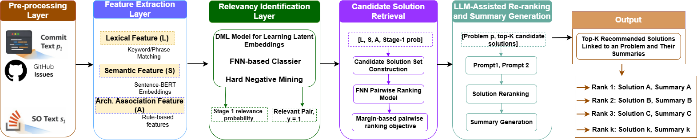

# Replication Package for the Paper:  
## *CPArchPSLinker: Cross-Platform Linking of Architectural Solutions from Q&A Platforms to Architectural Problems in Commits and Issues*

This replication package accompanies the paper **“CPArchPSLinker: Cross-Platform Linking of Architectural Solutions from Q&A Platforms to Architectural Problems in Commits and Issues.”**

The repository provides an overview of **CPArchPSLinker**, along with its source code and baseline implementations, the dataset of GitHub commits/issues and Stack Overflow posts used in the study, and the experimental results reported in the paper.

---

## 🚨 Introduction

Collaborative development platforms such as **GitHub** and Q&A websites such as **Stack Overflow (SO)** serve as complementary knowledge sources within the **Open Source Software (OSS)** ecosystem. When developers encounter architectural problems during OSS development, such as architectural anti-patterns, modularization issues, or performance bottlenecks, they often consult SO to identify potential solutions.

However, the unstructured, heterogeneous, and divergent nature of discussions on SO makes identifying relevant architectural solutions time-consuming and labor-intensive. To address this challenge, we define the problem of **linking architectural knowledge across Software Engineering (SE) platforms** (GitHub and SO) and introduce **CPArchPSLinker**, an automated approach designed for this task.

---

## 🏗️ CPArchPSLinker Overview

**CPArchPSLinker** is an approach for automatically linking architectural solutions from Q&A platforms to architectural problems described in GitHub commits and issues. The approach operates in three main stages.

### **Stage 1 – Identification of Relevant ⟨Architectural Problem, Solution⟩ Pairs**

In the first stage, CPArchPSLinker employs a Deep Metric Learning (DML)–based model to address cross-platform heterogeneity and distribution divergence between GitHub and SO artifacts. The DML model jointly projects architectural problems described in commits or issues and architectural solutions discussed in SO posts into a shared embedding space.

The model is trained such that semantically relevant ⟨architectural problem, solution⟩ pairs are mapped closer together in this space, while irrelevant pairs are pushed farther apart. This learned metric space enables the identification of cross-platform relevant pairs beyond surface-level textual similarity.

### **Stage 2 – Candidate Solution Retrieval and Rank Layer**

In the second stage, CPArchPSLinker performs architectural problem–solution linking by retrieving and ranking candidate solutions from Stack Overflow for a given GitHub commit or issue.

This stage integrates multiple complementary feature groups, including lexical similarity features, Sentence-BERT embeddings, architecture-aware association features, and the relevance probability signals produced by the Stage 1 DML model. These heterogeneous signals are combined within a learning-to-rank framework to estimate the relevance of each candidate solution and generate a ranked list of architectural solutions for each problem..

### **Stage 3 – LLM-Assisted Re-ranking and Summary Generation**

In the third stage, CPArchPSLinker further refines the ranked candidate solutions using a large language model (LLM).

Given the top-ranked candidates from Stage 2, the LLM (e.g., GPT-4o) performs context-aware re-ranking by reasoning over the semantic alignment between the architectural problem and each candidate solution, capturing higher-level design intent, trade-offs, and implicit architectural constraints that are not fully modeled by feature-based rankingb. In addition, this stage generates a concise natural language summary of the most relevant solutions, highlighting key architectural insights and their applicability to the target problem. This improves interpretability and supports practical adoption of the recommended solutions..


---

## 🧩 CPArchPSLinker Architecture

The **CPArchPSLinker architecture** consists of five primary layers.



## 📁 Repository Structure

```plaintext
├── CPArchPSLinker        # Source code for the CPArchPSLinker framework

├── RQ1_Baselines         # Baseline implementations for RQ1 evaluation

├── RQ2_Baselines         # Baseline implementations for RQ2 evaluation

├── data                  # Datasets used in the study

├── image/                # Contains a figure that illustrates the architecture of the proposed approach, CPArchPSLinker.

├── results/              # Experimental outputs requirements.txt

├── requirements.txt      # Lists all Python dependencies required to run the project

└── README.md             # Overview and usage instructions for this repository
```

## 🛠️ Dataset Description

The `data/` directory contains the following datasets:

- **`CrossPArchPSBench.xlsx`** – The benchmark dataset proposed in this study for evaluating techniques that link architectural solutions from SO to architectural problems described in GitHub commits and issues.  
  It contains **5,068 labeled ⟨architectural problem, solution⟩ pairs**, including **2,534 relevant (positive)** pairs and **2,534 irrelevant (negative)** pairs. Each pair links a GitHub architectural problem with a SO architectural solution and is annotated according to whether the solution addresses the problem. This benchmark dataset provides a reusable resource for future research, enabling consistent evaluation and comparison of architectural problem–solution linking approaches.

- **`2,071_Commits_Issues.xlsx`** – Contains **2,071 GitHub commits and issues** from **1,805 open-source projects** that describe architectural problems encountered during software development and reference architectural solutions from SO. Each entry includes the textual description of the architectural problem used in this study, while the corresponding solution descriptions are obtained from SO.

- **`2,534_Architectural_Solutions.xlsx`** – Contains **2,534 randomly selected architectural solutions** from the set of **10,423 architectural solutions (ARPs)** curated in our previous study [10]. These solutions were paired with GitHub architectural problems exctracted from GitHub commits and issues to construct the **irrelevant (negative) ⟨architectural problem, solution⟩ pairs** included in the benchmark dataset.

The `results/` directory contains the following dataset:

- **`Stage-2_Results.xlsx`** – Contains the intermediate relevance scoring results produced by CPArchPSLinker on the CrossPArchPSBench benchmark dataset. Each record corresponds to a candidate architectural problem–solution pair and includes: commit_id (GitHub commit or issue identifier), solution_id (Stack Overflow post identifier), problem_text (architectural problem description), solution_text (architectural solution description), stage2_score (relevance score predicted by the Stage-2 model), and stage2_rank (ranking position assigned to each solution for a given architectural problem)..

- - **`Stage-3_Results.xlsx`** – Contains the final linking results produced by CPArchPSLinker on the CrossPArchPSBench benchmark dataset. Each record represents a ranked and refined architectural problem–solution mapping after the final ranking stage, and includes: commit_id (GitHub commit or issue identifier), solution_id (Stack Overflow post identifier), problem_text (architectural problem description), solution_text (architectural solution description), summary (generated summary for each linked solution), and final_rank (final ranking position assigned to each solution for a given architectural problem).

## Requirements

The project dependencies are listed in requirements.txt.

To install all required packages, run:

```bash
pip install -r requirements.txt
```
> **Note:** For PyTorch, follow the official installation guide to ensure proper installation for your system (CPU or GPU support).


---
## 📝 Citation

```bibtex
@article{Musenga2025ArchISMiner,
  author = {Musengamana Jean de Dieu and Wenming Cao and Xinpeng Yin},
  title = {{CPArchPSLinker: Cross-Platform Linking of Architectural Solutions from Q&A Platforms to Architectural Problems in Commits and Issues}},
  journal={arXiv preprint arXiv:xxx},
  year={2026}
}
```
